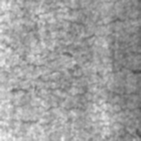
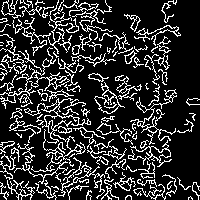
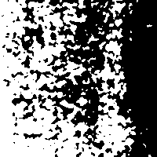
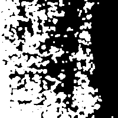
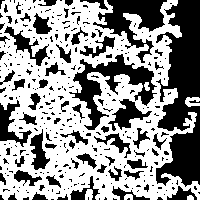
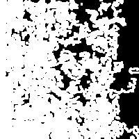

# 🏭 Industrial Surface Defect Detection

This repository provides a **complete industrial surface defect detection pipeline**
using both **Classical Image Processing** and **Deep Learning (YOLOv8 Classification)**.

The project demonstrates how defects in industrial surfaces such as *crazing,
inclusion, patches, pitted surface, rolled-in scale, scratches* can be detected,
classified, and visualized with strong engineering focus.

---

## ✅ Features
### Classical Computer Vision Pipeline
✔ Noise Reduction  
✔ Edge Detection  
✔ Thresholding  
✔ Morphological Operations  
✔ Final Defect Extraction  
✔ Step‑by‑step visual explanation

### Deep Learning (YOLOv8 Classification)
✔ Trains YOLOv8 on NEU surface defect dataset  
✔ Generates inference outputs  
✔ Produces metrics & performance reports  
✔ Provides training & validation visualizations  

---

## 📂 Project Structure
```
industrial-defect-detection-main/
 ├── classical/                 → Classical pipeline code
 ├── dl_yolov8_cls/             → YOLOv8 classification scripts
 ├── results/                   → All results & visualizations
 │   ├── classical/             → image processing outputs
 │   ├── dl/                    → deep learning outputs
 │   │   ├── inference/         → YOLO predictions
 │   │   ├── results.png        → training summary
 │   │   ├── confusion_matrix.png
 │   │   ├── confusion_matrix_normalized.png
 │   │   ├── results.csv
 │   │   ├── train_batch*.jpg
 │   │   ├── val_batch*.jpg
 ├── Readme.md
```

---

## 🚀 How to Run

### 🔹 Classical Pipeline
```
python classical/run_classical.py
```

### 🔹 Deep Learning YOLOv8 Classification
```
python dl_yolov8_cls/train_yolo_cls.py
```

---

# ⭐ Results & Visualizations

## 🔹 1️⃣ Classical Image Processing Results
The pipeline processes images through multiple stages.

| Step | Visualization |
|------|--------------|
| Original |  |
| Gaussian Blur |  |
| Edge Detection |  |
| Thresholding |  |
| Opening |  |
| Dilation |  |
| Final Combined Result |  |

---

## 🔹 2️⃣ Deep Learning (YOLOv8 Classification)

### 📌 Training Performance Summary


### 📌 Confusion Matrix


### 📌 Normalized Confusion Matrix


---

### 📌 Training Batch Samples


---

### 📌 Validation Predictions


---

## 🔹 3️⃣ Inference Examples
Predictions from YOLOv8 classification model:

Images stored here:
```
results/dl/inference/
```

Example:


---

## 📊 Metrics CSV
All numerical performance values are stored in:
```
results/dl/results.csv
```

You can open it in:
- Excel
- Pandas / Python
- Google Sheets

---

## 🎯 Summary
This project provides a **complete industrial defect detection workflow**
including:
✔ Classical Image Processing  
✔ Deep Learning Classification  
✔ Full Visual Proof  
✔ Engineering-ready design  

---

## 👨‍💻 Author
Industrial Defect Detection Research Project

